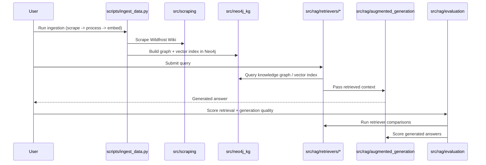

# WildFrostRAG

> A research-oriented Retrieval-Augmented Generation (RAG) system that benchmarks retrieval strategies — BM25, vector search, hybrid RRF, Text2Cypher, and Graph RAG — against a Neo4j knowledge graph built from the *Wildfrost* wiki.

WildFrostRAG is an ablation study answering one question: **is Graph RAG actually better than traditional retrieval for game-domain question answering, and why?** Card, tribe, and mechanics data is scraped from the Wildfrost Wiki, structured into a Neo4j knowledge graph, and queried by six different retrieval strategies. Each strategy is scored on retrieval metrics (NDCG, Hit@k, MRR) and generation quality, using an evaluation methodology inspired by Hamel Husain's RAG evaluation framework.

This is both a research project and a production-style engineering exercise — retrievers are dependency-injected, configuration is centralized and type-safe (Pydantic Settings), and experiments are tracked with an MLflow-like registry rather than scattered notebook output.

---

## Table of Contents

- [Architecture](#architecture)
- [Retrieval Strategies](#retrieval-strategies)
- [Installation](#installation)
- [Configuration](#configuration)
- [Quick Start](#quick-start)
- [Usage](#usage)
- [Project Structure](#project-structure)
- [Tests](#tests)
- [Documentation](#documentation)
- [License](#license)
- [Contact](#contact)

---

## Architecture



**Data flow:** Web Scraping → Data Processing → Neo4j Knowledge Graph → Embeddings → Retrieval → LLM Generation → Evaluation. See [`docs/`](docs/) for detailed per-stage diagrams.

## Retrieval Strategies

| Strategy | Description |
|---|---|
| **Base LLM** | Zero-shot, no retrieval — the control group |
| **BM25** | Keyword-based retrieval (`rank-bm25`) |
| **Vector Search** | Cosine similarity over `sentence-transformers` embeddings |
| **Hybrid (RRF)** | Reciprocal Rank Fusion combining BM25, fulltext, and vector search |
| **Text2Cypher** | LLM-generated Cypher queries against the graph schema |
| **Graph RAG** | Graph traversal / community-based retrieval (primary research target) |

---

## Results

Retrieval metrics from 50 hand-annotated reference queries, scored with Hit@k, MRR, and Recall@10 (regenerated 2026-08-23 against the current codebase — see [`docs/retrieval_comparison_run1.md`](docs/retrieval_comparison_run1.md) for exact reproduction commands). This is an early-stage comparison; a dedicated Graph RAG retriever is still in progress — see [Retrieval Strategies](#retrieval-strategies).

| Retriever | Hit@1 | Hit@10 | MRR | Recall@10 |
|---|---|---|---|---|
| Text2Cypher | 0.700 | 0.720 | 0.710 | 0.720 |
| Vector (MiniLM) | 0.820 | 0.960 | 0.877 | 0.960 |
| Fulltext | 0.820 | 0.960 | 0.859 | 0.960 |
| BM25 | 0.840 | 0.960 | 0.875 | 0.960 |
| Vector (Gemma) | 0.900 | 0.980 | 0.928 | 0.980 |
| BM25 + Vector (Gemma) Hybrid (RRF) | 0.900 | 0.980 | 0.927 | 0.980 |
| **Fulltext + Vector (Gemma) Hybrid (RRF)** | **0.900** | **0.980** | **0.933** | **0.980** |

**Key findings:**
- **Text2Cypher is the weakest strategy by far** (Hit@1: 0.700, Hit@10: 0.720) — LLM-generated Cypher queries frequently return zero or wrong results, capping Hit@10 well below every other method.
- Vector search benefits substantially from embedding model choice: Gemma clearly outperforms MiniLM (MRR 0.928 vs. 0.877).
- **Fulltext + Vector (Gemma) hybrid RRF is the best performer**, with the highest MRR of any strategy tested.
- Graph-traversal-augmented retrieval (vector/fulltext → Cypher expansion) currently scores **identically** to its non-graph base retriever on this query set — the Cypher-expansion step isn't yet adding measurable retrieval value, which is the open question this project is still investigating.

Full breakdown and reproduction steps in [`docs/retrieval_comparison_run1.md`](docs/retrieval_comparison_run1.md).

---

## Installation

**Requirements:** Python 3.12, [Poetry](https://python-poetry.org/), a running Neo4j 5.x instance.

```bash
git clone https://github.com/LakhvirMadhar/WildFrostRAG.git
cd WildFrostRAG

poetry install
poetry shell
```

---

## Configuration

Copy the example env file and fill in your own values:

```bash
cp .env.example .env
```

| Variable | Description | Required |
|---|---|---|
| `NEO4J_URI` | Neo4j connection string, e.g. `bolt://localhost:7687` | Yes |
| `NEO4J_USERNAME` | Neo4j username | Yes |
| `NEO4J_PASSWORD` | Neo4j password | Yes |
| `OPENAI_API_KEY` | OpenAI API key for generation | Yes |
| `EMBEDDING_MODEL_NAME` | Sentence-transformers model name | No — defaults to `all-MiniLM-L6-v2` |
| `OPENAI_MODEL_NAME` | OpenAI model for generation | No |

All settings are loaded through `src/utils/config.py` (Pydantic Settings) — see that file for the full list of configurable values (RRF `k1`, index names, scraping concurrency, etc.).

---

## Quick Start

Run the full ETL pipeline, then run and compare two retrievers:

```bash
# 1. Scrape, process, embed, and ingest into Neo4j
poetry run python -m scripts.ingest_data --no-chunking

# 2. Run a retrieval experiment
poetry run python -m scripts.experiment retrieval --retriever bm25 --description "Baseline BM25"

# 3. Generate answers using that retrieval
poetry run python -m scripts.experiment generation --retrieval latest/bm25 --prompt SYSTEM_PROMPT_V1

# 4. Score retrieval quality
poetry run python -m scripts.calculate_retrieval_metrics --run-num 1
```

---

## Usage

### Experiment CLI (recommended)

```bash
poetry run python -m scripts.experiment current                      # show current run number
poetry run python -m scripts.experiment retrieval --retriever vector  # run a retriever
poetry run python -m scripts.experiment list --type retrieval         # list experiments in current run
poetry run python -m scripts.experiment search --retriever-type bm25  # search across all runs
poetry run python -m scripts.experiment new-run                       # start a fresh run
```

### Direct scripts (for debugging / full parameter control)

```bash
poetry run python -m scripts.evaluate_retrievers --run-num 1 --retriever text2cypher --chunking no
poetry run python -m scripts.run_llm_generation --run-num 1 --retrieval-reference bm25/001 --system-prompt SYSTEM_PROMPT_V1
```

Full command reference lives in [`CLAUDE.md`](CLAUDE.md).

---

## Project Structure

```
WildFrostRAG/
├── scripts/                    # CLI entry points (ingest, experiment, evaluate)
├── src/
│   ├── scraping/                # Wildfrost Wiki scraping
│   ├── data_processing/         # HTML parsing, card extraction, enrichment
│   ├── embeddings/              # Embedding generation
│   ├── neo4j_kg/                # Neo4j graph + vector store management
│   ├── rag/
│   │   ├── retrievers/          # BM25, vector, hybrid, Text2Cypher, GraphRAG
│   │   ├── augmented_generation/# LLM generation (zero-shot + RAG)
│   │   └── evaluation/          # Retrieval + generation metrics
│   ├── experiment_tracker/      # MLflow-style experiment registry
│   ├── prompts/                 # Versioned system / Text2Cypher prompts
│   └── utils/                   # Config, logging
├── tests/
├── docs/                        # Per-component design docs and diagrams
├── queries/                     # Annotated query dataset + failure mode taxonomy
├── data/                        # Structured card data, schemas, raw HTML
├── .env.example
├── pyproject.toml
└── LICENSE
```

---

## Tests

```bash
poetry run pytest
```

---

## Documentation

Detailed design notes and diagrams live in [`docs/`](docs/), including:

- [`docs/retriever_docs/`](docs/retriever_docs/) — how each retrieval strategy works
- [`docs/data_ingestion_process.md`](docs/data_ingestion_process.md) / [`docs/query_answering_process.md`](docs/query_answering_process.md) — pipeline flow diagrams

---

## License

Distributed under the MIT License. See [LICENSE](LICENSE) for details.

## Contact

Lakhvir Madhar — [171702328+LakhvirMadhar@users.noreply.github.com](mailto:171702328+LakhvirMadhar@users.noreply.github.com)

Project link: [https://github.com/LakhvirMadhar/WildFrostRAG](https://github.com/LakhvirMadhar/WildFrostRAG)
