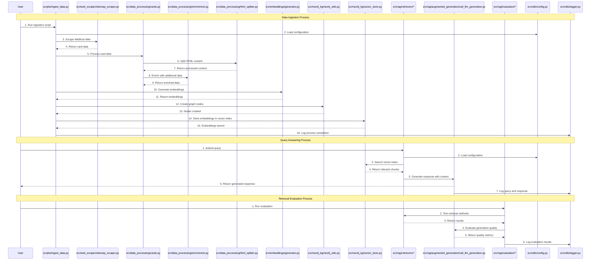
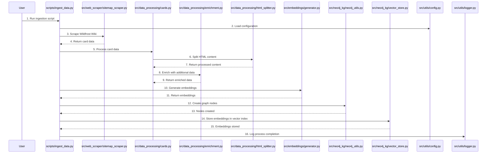
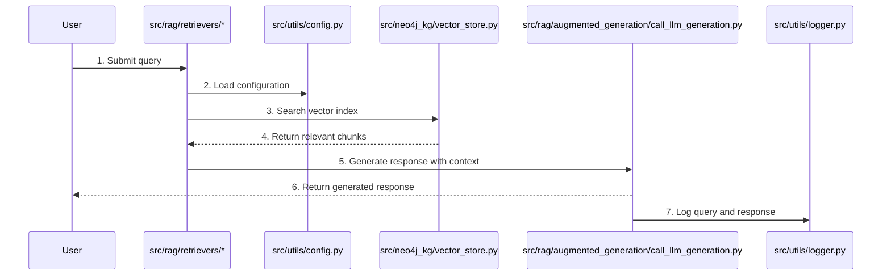
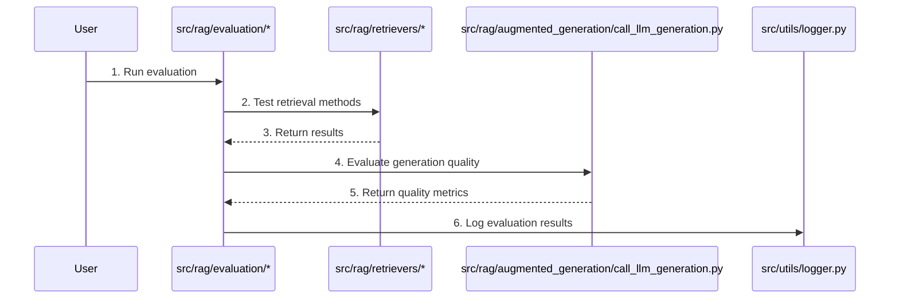

# WildFrostRAG Project Context

## Project Overview
**WildFrostRAG** is a research-oriented Retrieval-Augmented Generation (RAG) system for the game *Wildfrost*. The primary objective is to evaluate and compare different retrieval strategies—ranging from traditional vector search to advanced Graph RAG—using game data (Cards, Tribes, Stats) scraped from the Wildfrost Wiki and stored in a Neo4j Knowledge Graph.
This project can be viewed as an abalation study of retrieval and generation metrics.

## Core Research Goals
The project aims to benchmark the following RAG implementations:
1.  **Base LLM:** Zero-shot performance using innate model knowledge (no retrieval).
2.  **Traditional RAG:** 
    *   **BM25:** Keyword-based retrieval.
    *   **Cosine Similarity:** Standard vector-based retrieval.
    *   **Hybrid:** Reciprocal Rank Fusion (RRF) of BM25 and Cosine Similarity.
3.  **Text2Cypher:** Using Neo4j's Text2Cypher extension to generate Cypher queries against the established Wildfrost ontology in Neo4j.
4.  **Graph RAG:** Implementing advanced graph traversal or community-based retrieval (the primary learning objective).

## Evaluation Framework
The project follows a rigorous evaluation style inspired by **Hamel Husain’s framework**:
*   **Query Generation:** User-generated queries from random samples of documents based on game schemas (`query_generation.ipynb`).
*   **Retrieval Metrics:** Measuring how accurately the system finds relevant chunks or nodes using metrics like NDCG and Hit@k.
*   **Generation Metrics:** Evaluating the quality of the final answer based on user-defined criteria.
*   **Qualitative Coding:** Using "Open Coding" and "Axial Coding" to categorize failure modes in `queries/simple_reference_based_queries.csv`.

## Architecture & Components

### 1. Data Layer (`data/`)
*   `structured_outputs/`: Processed card data organized by `CardType`.
*   `schemas/`: JSON definitions of card types and game mechanics.

### 2. Knowledge Graph (`src/neo4j_kg/`)
*   Manages the Neo4j instance.
*   Maps relationships like `BELONGS_TO_TRIBE`, `HAS_CARD_TYPE`, and `HAS_STAT`.
*   Nodes: `Card`, `Tribe`, `Stat`, `CardType`, `Document`.

### 3. Model Integrations
*   **OpenAI:** Used for baseline zero-shot and RAG comparisons.

## Program Flow Diagram

The following Mermaid sequence diagram illustrates the flow of operations in the WildFrostRAG project, showing how different components interact during key processes:

## Key Process Flows

The diagram shows the following key operational sequences:

1. **Data Ingestion Process**: How data flows from web scraping through processing, enrichment, embedding generation, and storage in the knowledge graph.

2. **Query Answering Process**: How user queries are handled by the retrieval system and passed to the LLM generation component.

3. **Retrieval Evaluation Process**: How the system evaluates the quality of retrieval and generation components.

## Detailed Process Diagrams

For more detailed views of each process, see the individual diagrams below:

### Data Ingestion Process

### Query Answering Process

### Retrieval Evaluation Process

## Planned Further Steps & Roadmap

### 1. Notebook Cleanup (COMPLETE)
*   **`rag_eval_demo.ipynb`:** Currently acts as a scratchpad. Needs to be stripped of scraped logic, hardcoded paths, and unused imports. It should solely focus on *demonstrating* the pipeline, calling functions from the `src` directory.
*   **`query_generation.ipynb`:** Contains a massive `QueryAnnotationGUI` class and mixed logic for generation and evaluation. The GUI code should be moved to a module, and the notebook should focus on the interactive analysis loop.

### 2. Codebase Refactoring
*   **Modularization:** Move the `QueryAnnotationGUI` class to `src/utils/gui.py` or `src/evaluation/gui.py`.
*   **Consolidation:** Ensure `scrape_sitemap` and `process_sitemap_urls` are tightly integrated into a single ingestion pipeline rather than disjointed function calls.
*   **Type Safety:** Add Pydantic models for configuration to replace loose environment variable fetching scattered across files.

### 3. Orchestration Scripts
*   **`scripts/ingest_data.py`:** Create a dedicated CLI script to handle the full ETL pipeline (Scrape -> Process -> Vectorize -> Ingest to Neo4j). This removes the dependency on Jupyter for data setup.
    *   *Usage:* `python -m scripts.ingest_data --force-scrape`

### 4. Agent Suggestions (Recommended)
*   **Evaluation Pipeline Module:** Create `src/evaluation/metrics.py` to house the logic for `NDCG`, `Hit@k`, and `Recall`. This allows these metrics to be computed programmatically during CI/CD or batch runs, not just in notebooks.
*   **Configuration Management:** Implement a central `config.py` (using `pydantic-settings`) to manage model names, embedding dimensions, and database URIs. This prevents "magic strings" like `'all-MiniLM-L6-v2'` from appearing in multiple files.
*   **Dependency Separation:** The project currently mixes "application" dependencies (FastAPI, Streamlit) with "analysis" dependencies (Jupyter, Pandas). Consider grouping these in `pyproject.toml` (e.g., `tool.poetry.group.dev.dependencies`).

##  Current Plan of Action

### Setting up other vector searches + adding in manual retrieval metrics
1.  **BM25**
    *   Setup rankbm25 library for articles (COMPLETE)
    *   Setup Neo4j's Lucene 

2.  **Cosine Similarity** (DOUBLE CHECK IF COMPLETE)
    *   Use cosine similarity for 

3.  **Hybrid Similarity** (COMPLETE I THINK)
    *   Given the lexical and semanitc search, figure out a way to 

4.  **Neo4j's text2Cypher library** (WIP)
    *   Use Neo4j's text2Cypher library 

5.  **Knowledge Graph** (NO IDEA)
    *   Idk how a knowledge graph is supposed to work, but this is the goal. Is a knowledge graph "better" than the other methods?

Given the above retrieval techniques, we need to setup the retrieval metrics
1.  **hit@k**
    *   This establishes stuff like precision@k and recall@k, which k being the number of documents retrieved (eg. 1, 2, 5, 10).

2.  **NCDG**
    *   Does this make sense? I don't actually know the expected order

3.  **MRR**
    *   Mean Recipricocal Rank, I think this one is applicable?

4.  **RRF**
    *   Recipricol Rank Fusion, I don't remember what this means

### Phase 3: Data Processing/Chunking
1.  **Chunking**
    *   Currently have a chunking option and no chunking option. No chunking is fine as is, it caputres the entire document.
    *   The HTML splitter needs some work, as it splits headers but some headers are just the name of the card, therefore it becomes an irrelevant chunk during retrieval

2.  **Missing Features/Pages to Still Scrape**
    In this section, there are many pages I still need to scrape to capture the complete wiki. If it was just scraping the full site, that'd be easy. The problem is mapping the ontology considering there are many other things that make this very complicated.

    a. Cards with multiple phases or states (like Infernoko or Naked Gnome) or not properly being scraped atm
        
        - For cards with phases, we can have the following possible relationship: card -> has phase -> phase
    
    b. Adding fields to card nodes
        
        - Other Stats field  (Resist Snow, Frenzy, etc. This is the Stats page, which needs scraping and processing: https://wildfrostwiki.com/Stats)
        
        - flavor text (either null or str)
        
        - abilities, which are broken into two: The listed ability and the canonical ability to scrape from the excel sheet
            -   Example: "Increase attack by 2" & "Increase attack by 1" is actually "Increase attack by <n>"
    
    c. Probably need to do a keyword or ability node as this can get complicated. Certain keywords are part of an ability: https://wildfrostwiki.com/Keywords
        
        - Example: "Apply 3 <keyword> Snow </keyword>." We would have to link abilities to keywords.
            -- Card -> has ability -> ability
            -- Ability -> has keyword -> keyword
  
    d. Need to add logic to scrape the Leaders page. 
    
        - For relations, it should link them to the tribe and to a leader node (there can only be one leader) 
        - I should probably make a leader node.
            -- Tribe -> has leader -> Leader
            -- Leader -> has permanent crown -> Crown
            -- if the leader dies, the run dies (whatever this would look like)
            -- Leader -> belongs to tribe -> Tribe (each tribe has leaders)
            -- Card -> has subtype -> Leader
            -- Somehow figure out how to make the leader cards, they are a little different from a normal card
            -- You can only have one leader

    e. Pets should also get a pet node 
        
        - There can only be one pet chosen per run
        - Pets are chosen to be part of the starting deck

    f. I should add a starting deck
        
        - Leader -> starts in -> Player deck
        - Pets -> starts in -> Player deck
        - Starting item cards -> starts in -> Player deck (we'd also need to add the quantity)
    
    g. Crowns. They are a thing and I need to include them into my data

    h. Maps have it's own ontology: https://wildfrostwiki.com/Map. 
        
        - Map -> contains -> zones
        - Zones -> contains -> fights
        - Zones -> contains -> map events (the inbetween after each fight, depending on the zone.) 
        - Map Events -> contains -> events (the specific events?) what's different with the one above is it's the order of fights and events. 1st fight -> event-> etc. I want to capture the individual events as well and when they show up???
    
    i. Fights have their own kind of ontology too 
        
        - Enemies -> appear in -> fights 
        - Fights -> has -> enemies
        - Fights -> has -> waves
        - Enemies -> appears in -> waves
        - waves -> has -> enemies
        - Need to somehow relate to this the playing field itself too and the bell system. Not fun
    
    j. Speaking of playing field, probably need to map this as well.
        
        - Hm, probably need something for how fights themselves play out (1 card is played OR player hits their sun bell, then enemy turn progresses). A lot I have to do here.

    i. I need to add the bell system as they relate to everything as well.
        
        - You need to select the 10 bell difficulty to even do the final fight in map events. 
        - Need to also scrape the pages as well

    k. I'm not saving the card image anywhere, unsure if needed atm.
    
    l.   Need to update the to_dict method to capture more information I'm missing
        
        - *Important**: I need to make sure the to_dict method is expanded to make a very cleaned format of the HTML.
    
### 4. **Important**: Logger needs updating
    
    -   It's currently saving all to one file, we need to make it several files. Also need to fix print statements or tqdm write statements to instead be logger.
    
### 5. Support for multiple Embeddings
    
    -   Adding the ability to have multiple embeddings from different providers and testing that.

### 6. Setting up the retrievers
    
    - Continue the work with setting up the retrievers

### Overall Theme
*   The `rag_eval_demo.ipynb` will be for any scraping and neo4j ingestion testing the user deems necessary.
*   The `query_generation.ipynb` will remain the primary entry point for running RAG experiments and evaluations.

## Building and Running

### Prerequisites
*   Python 3.12+ (managed by Poetry).
*   Neo4j instance (Local Bolt: `bolt://localhost:7687`).
*   Environment variables in `.env`: `OPENAI_API_KEY`, `NEO4J_USERNAME`, `NEO4J_PASSWORD`.

### Key Workflows
*   **Data Prep:** Use `rag_eval_demo.ipynb` to test scraping and parsing of data, and ingest data into Neo4j.
*   **Eval Run:** Use `query_generation.ipynb` to run experiments across different RAG versions.
*   **Analysis:** Use the `QueryAnnotationGUI` (built with ipywidgets) to manually validate and code responses.
