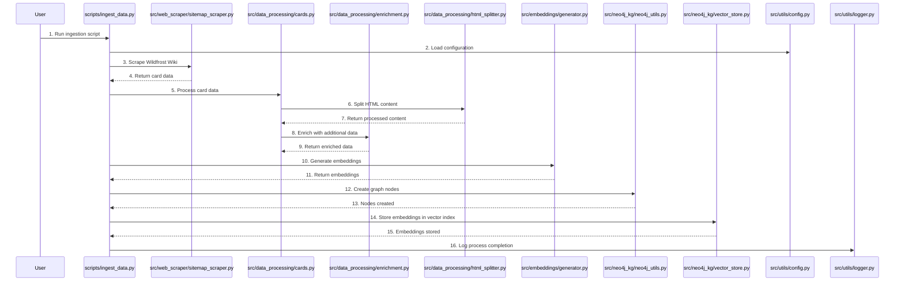

# Data Ingestion Process

The following Mermaid sequence diagram illustrates the data ingestion process in the WildFrostRAG project, showing how different components interact during data ingestion:

## Process Overview

This diagram shows the complete data ingestion process:

1. User initiates the ingestion script
2. Configuration is loaded
3. Web scraping occurs to gather URLs
4. Card data is processed and enriched
5. HTML content is split and processed
6. Embeddings are generated
7. Graph nodes are created in Neo4j
8. Embeddings are stored in the vector index
9. Process completion is logged