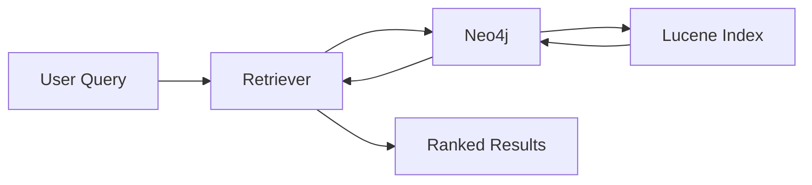

# Documentation Guide for Software Engineers

## How Senior SWEs Approach Documentation

This guide explains what documentation to write, when to write it, and what to include - based on industry best practices from senior engineers.

---

## Table of Contents

1. [Types of Documentation](#types-of-documentation)
2. [Documentation Hierarchy](#documentation-hierarchy)
3. [What to Include in Each Type](#what-to-include-in-each-type)
4. [When to Write Documentation](#when-to-write-documentation)
5. [Best Practices](#best-practices)
6. [Tools and Formats](#tools-and-formats)
7. [Documentation for WildFrostRAG](#documentation-for-wildfrostrag)

---

## Types of Documentation

### 1. **README** (Project Overview)
- **Purpose**: First thing anyone sees, project introduction
- **Audience**: New users, contributors, stakeholders
- **Location**: Root directory (`README.md`)
- **Update Frequency**: Every major change

### 2. **API Documentation** (Interface Reference)
- **Purpose**: How to use functions, classes, endpoints
- **Audience**: Developers using your code
- **Location**: Docstrings, auto-generated docs
- **Update Frequency**: Every time API changes

### 3. **Architecture Documentation** (System Design)
- **Purpose**: How the system works, design decisions
- **Audience**: Engineers maintaining/extending the system
- **Location**: `docs/architecture/` or wiki
- **Update Frequency**: Major refactors, new components

### 4. **Runbooks** (Operational Guides)
- **Purpose**: How to run, deploy, troubleshoot
- **Audience**: DevOps, on-call engineers, yourself in 6 months
- **Location**: `docs/runbooks/` or ops wiki
- **Update Frequency**: When processes change

### 5. **Tutorials/Guides** (Learning Resources)
- **Purpose**: Teach concepts, walk through use cases
- **Audience**: Learners, new team members
- **Location**: `docs/tutorials/`, `docs/guides/`
- **Update Frequency**: As needed

### 6. **ADRs (Architecture Decision Records)**
- **Purpose**: Why you made specific technical choices
- **Audience**: Future maintainers (including future you)
- **Location**: `docs/adr/` or `docs/decisions/`
- **Update Frequency**: When making significant decisions

### 7. **CHANGELOG** (Version History)
- **Purpose**: What changed between versions
- **Audience**: Users, maintainers
- **Location**: Root directory (`CHANGELOG.md`)
- **Update Frequency**: Every release

### 8. **Contributing Guide**
- **Purpose**: How to contribute to the project
- **Audience**: External contributors
- **Location**: Root directory (`CONTRIBUTING.md`)
- **Update Frequency**: When contribution process changes

---

## Documentation Hierarchy

**Priority Order (what to write first):**

```
1. README
   └─> Quick start, what this project does

2. Code Comments / Docstrings
   └─> How to use this function/class

3. Architecture Docs
   └─> How the system fits together

4. Runbooks / Operational Docs
   └─> How to run/deploy/troubleshoot

5. Tutorials / Guides
   └─> Deep dives into specific topics

6. ADRs
   └─> Why we made these choices
```

**Rule of thumb:** Write docs that unblock people *right now*, then backfill depth later.

---

## What to Include in Each Type

### README.md

**Essential sections:**
```markdown
# Project Name

## What is this?
1-2 sentences explaining the project

## Why does this exist?
The problem it solves

## Quick Start
Minimal steps to run it

## Installation
Detailed setup instructions

## Usage
Common commands, examples

## Project Structure
High-level directory overview

## Contributing
How to contribute (or link to CONTRIBUTING.md)

## License
Project license
```

**Example:** See WildFrostRAG's main README

### API Documentation (Docstrings)

**Function docstring template:**
```python
def search(self, query: str, k: int = 5) -> List[Dict[str, Any]]:
    """
    [One-line summary of what this does]

    [Optional: More detailed explanation if needed]

    Args:
        query: [What this parameter is, format, constraints]
        k: [What this parameter is, default behavior]

    Returns:
        [What the function returns, structure, format]

    Raises:
        ValueError: [When and why this is raised]
        ConnectionError: [When and why this is raised]

    Example:
        >>> retriever.search("Frost Guardian", k=5)
        [{'text': '...', 'score': 4.32, ...}, ...]

    Note:
        [Important caveats, performance notes, edge cases]
    """
```

**Class docstring template:**
```python
class Neo4jFullTextSearch(BaseNeo4jRetriever):
    """
    [One-line summary of what this class does]

    [Detailed explanation of purpose, behavior, use cases]

    This class implements [algorithm/pattern] to provide [capability].
    It follows [design pattern] by [explanation].

    Attributes:
        index_name: [What this attribute stores]
        driver: [What this attribute stores]

    Example:
        >>> driver = GraphDatabase.driver(uri, auth=(user, pass))
        >>> retriever = Neo4jFullTextSearch(driver)
        >>> results = retriever.search("query", k=5)
    """
```

### Architecture Documentation

**What to include:**
1. **System Overview Diagram**
   - High-level components and data flow
   - ASCII art or actual diagrams (Mermaid, Draw.io)

2. **Component Descriptions**
   - What each major component does
   - How they interact
   - Technology choices (and why)

3. **Data Flow**
   - How data moves through the system
   - Processing pipeline stages

4. **Key Design Patterns**
   - Dependency injection, factory pattern, etc.
   - Why you chose them

5. **External Dependencies**
   - What you depend on (Neo4j, OpenAI API, etc.)
   - Why you chose them

**Example:** WildFrostRAG's CLAUDE.md has "Architecture Overview" section

### Runbooks

**Template:**
```markdown
# [Task Name] Runbook

## Purpose
What this task accomplishes

## Prerequisites
- Requirement 1
- Requirement 2

## Steps

### Step 1: [Action]
```bash
command here
```
Expected output: [what you should see]

### Step 2: [Action]
```bash
another command
```
Expected output: [what you should see]

## Troubleshooting

### Problem: [Common issue]
**Symptoms:** [How you know this is the problem]
**Solution:** [How to fix it]

### Problem: [Another issue]
...

## Verification
How to confirm it worked

## Rollback
How to undo if something goes wrong
```

### Tutorial/Guide

**Structure:**
1. **Introduction**: What you'll learn
2. **Prerequisites**: What you need to know first
3. **Concepts**: Theory/background
4. **Step-by-step walkthrough**: Hands-on examples
5. **Advanced topics**: Deep dives
6. **Next steps**: Where to go from here

**Example:** The fulltext_search.md I just created!

### ADR (Architecture Decision Record)

**Template:**
```markdown
# ADR-001: [Short Title]

## Status
Accepted | Rejected | Deprecated | Superseded by ADR-XXX

## Context
What problem are we solving?
What constraints exist?

## Decision
What did we decide to do?

## Consequences
Positive:
- Benefit 1
- Benefit 2

Negative:
- Trade-off 1
- Trade-off 2

## Alternatives Considered
- Option A: [why rejected]
- Option B: [why rejected]

## References
- Link to discussion
- Link to relevant docs
```

**Example:**
```markdown
# ADR-001: Use Neo4j for Knowledge Graph Storage

## Status
Accepted

## Context
We need to store Wildfrost card data with relationships (Card → Tribe, Card → CardType).
We want to support both vector search and graph traversal.

## Decision
Use Neo4j as our primary database for both graph storage and vector search.

## Consequences
Positive:
- Native graph traversal (efficient for Graph RAG)
- Built-in vector search (no separate vector DB needed)
- Cypher query language (expressive, readable)

Negative:
- Must run separate Neo4j server (can't use SQLite)
- Learning curve for Cypher
- Deployment complexity

## Alternatives Considered
- PostgreSQL + pgvector: No native graph traversal
- Separate graph DB + vector DB: Increased complexity
```

---

## When to Write Documentation

### Write Immediately (Before/During Code)
- **Docstrings**: As you write functions
- **Code comments**: For non-obvious logic
- **README updates**: When adding features

### Write Soon After (Within Days)
- **Architecture docs**: After major refactors
- **ADRs**: After making significant decisions
- **Runbooks**: After setting up new processes

### Write When Needed (Backfill)
- **Tutorials**: When users ask "how do I...?"
- **Troubleshooting guides**: After solving tricky bugs
- **Performance guides**: After optimization work

### Rule: "Document the pain"
If you struggled to understand something, document it so others don't have to struggle.

---

## Best Practices

### 1. **Write for Your Audience**
- **README**: Non-technical stakeholders → use simple language
- **API docs**: Other developers → be precise, show examples
- **Runbooks**: On-call engineer at 2am → be explicit, no assumptions

### 2. **Show, Don't Just Tell**
```markdown
❌ Bad: "Use the retriever to search"

✓ Good:
```python
retriever = Neo4jFullTextSearch(driver)
results = retriever.search("Frost Guardian", k=5)
for result in results:
    print(result['text'])
```

### 3. **Keep It Updated**
- **Stale docs are worse than no docs** (they mislead!)
- Update docs in the same PR as code changes
- Delete outdated docs rather than leaving them

### 4. **Use Clear Structure**
- Headings, bullet points, code blocks
- Table of contents for long docs
- Cross-references to related docs

### 5. **Explain the "Why"**
```markdown
❌ Bad: "Set timeout to 30 seconds"

✓ Good: "Set timeout to 30 seconds because Neo4j index creation
         can take up to 20 seconds on large datasets"
```

### 6. **Examples > Explanations**
- One working example is worth 1000 words
- Show the happy path first
- Then show edge cases

### 7. **Progressive Disclosure**
```markdown
## Quick Start (for impatient users)
```bash
npm install && npm start
```

## Detailed Installation (for those who want to understand)
[...detailed steps...]
```

---

## Tools and Formats

### Markdown (Most Common)
- **Pros**: Simple, readable, works everywhere
- **Cons**: Limited formatting
- **Use for**: README, guides, ADRs

### Docstrings (Code-Level)
- **Python**: reStructuredText, Google style, NumPy style
- **Tools**: Sphinx (auto-generates HTML docs from docstrings)
- **Use for**: API documentation

### Wikis (Collaborative)
- **Tools**: GitHub Wiki, Confluence, Notion
- **Pros**: Easy editing, search, collaboration
- **Cons**: Separate from code (can get out of sync)
- **Use for**: Team knowledge base, runbooks

### Diagrams
- **ASCII art**: Great for simple diagrams in markdown
- **Mermaid**: Diagrams as code (rendered in GitHub)
- **Draw.io**: Complex diagrams
- **Use for**: Architecture, data flow, sequence diagrams

**Example Mermaid diagram:**


---

## Documentation for WildFrostRAG

### Current Structure
```
WildFrostRAG/
├── README.md                    # Project overview (TODO: create)
├── CLAUDE.md                    # AI assistant instructions (project context)
├── docs/
│   ├── documentation_guide.md   # This file (meta-documentation)
│   └── retriever_docs/
│       └── fulltext_search.md   # Fulltext retriever guide
├── src/
│   └── [code with docstrings]   # API documentation
└── scripts/
    └── [scripts with usage comments]
```

### Recommended Additions

**1. Project README**
Create `README.md` in root:
- What is WildFrostRAG?
- Quick start guide
- Link to docs/

**2. Architecture Document**
Create `docs/architecture.md`:
- System overview diagram
- Component descriptions
- Why Neo4j? Why OpenAI? (ADR-style)

**3. More Retriever Docs**
Create in `docs/retriever_docs/`:
- `vector_search.md` - How vector retrieval works
- `bm25.md` - How BM25 works
- `hybrid_retrieval.md` - How RRF combines retrievers
- `comparison.md` - When to use which retriever

**4. Runbooks**
Create `docs/runbooks/`:
- `setup.md` - Full environment setup
- `data_pipeline.md` - Running the ETL pipeline
- `evaluation.md` - Running experiments
- `troubleshooting.md` - Common issues and fixes

**5. Research Documentation**
Create `docs/research/`:
- `methodology.md` - Evaluation framework explanation
- `experiments.md` - Experiment log (what you tried, results)
- `findings.md` - Key insights from research

---

## Documentation Checklist

Before committing code, ask:

- [ ] Did I update docstrings for new/changed functions?
- [ ] Did I update CLAUDE.md if architecture changed?
- [ ] Did I add examples for new features?
- [ ] Did I update the relevant guide in `docs/`?
- [ ] Did I document any gotchas or edge cases?
- [ ] Can someone else run this without asking me questions?

---

## Further Reading

**Books:**
- *Docs for Developers* by Jared Bhatti (Google engineer)
- *The Documentation Compendium* (open-source guide)

**Websites:**
- [Write the Docs](https://www.writethedocs.org/) - Documentation community
- [Divio Documentation System](https://documentation.divio.com/) - 4 types of documentation framework

**Examples of Great Documentation:**
- [Stripe API docs](https://stripe.com/docs/api) - API documentation
- [Django docs](https://docs.djangoproject.com/) - Tutorials + reference
- [Kubernetes docs](https://kubernetes.io/docs/) - Complex system, clear docs

---

## Key Takeaway

**Good documentation has three properties:**

1. **Accurate**: Reflects current reality (not outdated)
2. **Accessible**: Easy to find and understand
3. **Actionable**: Reader can do something after reading it

**Senior SWE mindset:** "Documentation is not a chore, it's a force multiplier."

Every hour you spend on docs saves 10 hours of confusion for others (and future you).

---

*Last Updated: 2026-01-18*
