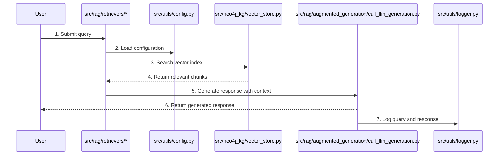

# Query Answering Process

The following Mermaid sequence diagram illustrates the query answering process in the WildFrostRAG project, showing how different components interact when processing user queries:

## Process Overview

This diagram shows the complete query answering process:

1. User submits a query
2. Configuration is loaded
3. The retriever searches the vector store for relevant chunks
4. Relevant chunks are returned
5. The LLM generates a response using the context
6. The response is returned to the user
7. The query and response are logged