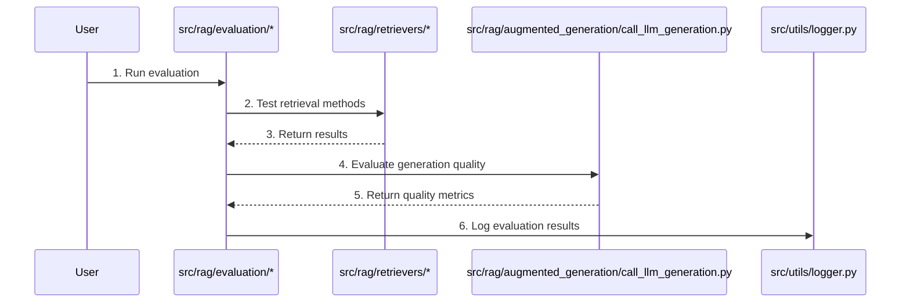

# Retrieval Evaluation Process

The following Mermaid sequence diagram illustrates the retrieval evaluation process in the WildFrostRAG project, showing how different components interact during evaluation:

## Process Overview

This diagram shows the complete retrieval evaluation process:

1. User initiates an evaluation
2. The evaluation module tests retrieval methods
3. Results are returned from the retriever
4. Generation quality is evaluated
5. Quality metrics are returned
6. Evaluation results are logged